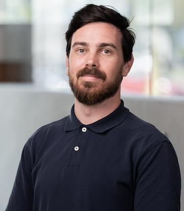
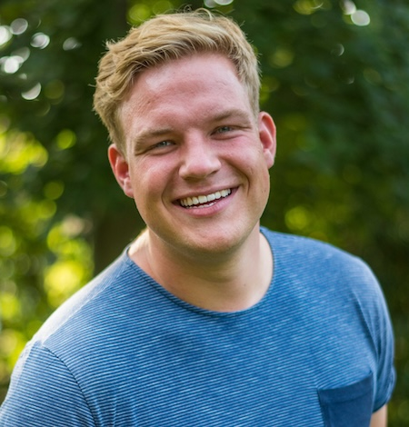
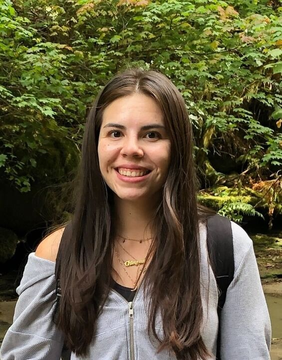
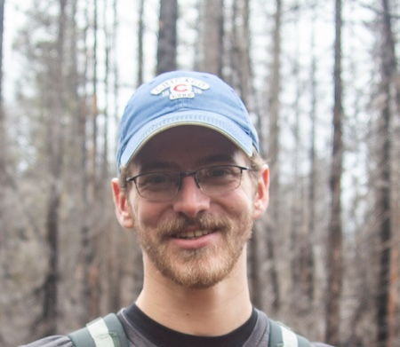

## Ian Shryock

Ian is a fifth-year doctoral student in the clinical and personality areas. His research focuses on understanding transdiagnostic emotional processes as they unfold in daily life. He is also interested in improving the measurement of psychological attributes in research and clinical practice. Accordingly, he uses a combination of mixed-effects models, distributional regression, and item response theory in his work.

## Dominik Grätz

Dominik is a fifth-year PhD student in Ulrich Mayr's lab at the University of Oregon. He is interested in cognitive control, specifically in how the cognitive system selects information from different sources. He uses R primarily to clean, analyze, and visualize data, but also to create Shiny applications or to edit images.

## Denicia Espinosa Aragon 

Denicia is a fourth-year doctoral student in Psychology at the University of Oregon. Her research focuses on future self perception, neuroeconomics, underrepresented population perspectives. More specifically, she is interested in how to improve how individuals connect with their future self to make for better current actions.

## Ben Chaloupka

Ben is entering the final year of his PhD program at UO. He is a member of Dasa Zeithamova's Brain and Memory Lab studying the cognitive neuroscience of memory. Outside of the lab, Ben spends most of his time rock climbing, mountaineering, and playing disc golf. He loves R and RStudio/Posit, and uses them for data cleaning, analysis, and visualization for his dissertation research, as well as for fun, such as analyzing his climbing data (yes, he logs all of his outdoor climbs). 

