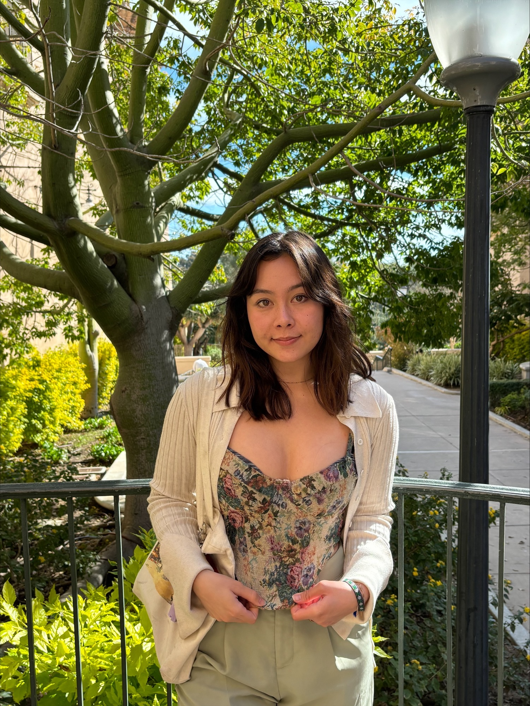
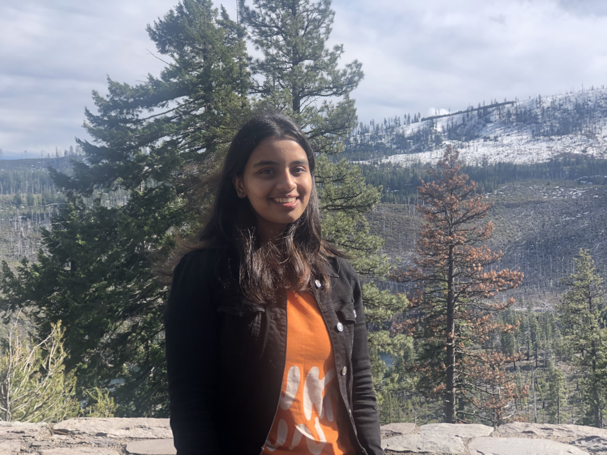

## Ian Shryock

Ian is a sixth-year doctoral student in the clinical and personality areas. His research focuses on understanding transdiagnostic emotional processes as they unfold in daily life. He is also interested in improving the measurement of psychological attributes in research and clinical practice. Accordingly, he uses a combination of mixed-effects models, distributional regression, and item response theory in his work.

## Dominik Grätz

Dominik is a sixth-year PhD student in Ulrich Mayr's lab at the University of Oregon. He is interested in cognitive control, specifically in how the cognitive system selects information from different sources. He uses R primarily to clean, analyze, and visualize data, but also to create Shiny applications or to edit images.

## Sophia Angleton 

Sophia is a second-year PhD student working with Ulrich Mayr in the Cognitive Dynamics Lab. Her research interests include cognitive control- specifically cognitive stability/flexibility mechanisms, decision-making, working memory and pre-crastination. She uses R to clean, analyze and visualize data and is currently taking the Educational Data Science Specialization course series offered here at the University of Oregon. Outside of research, she enjoys spending time with her two cats, biking, swimming, climbing and searching (in vain) for half-decent food in Eugene.

## Neha Nagarkar

Neha is a second year PhD student in Dr. Ulrich Mayr’s lab at the University of Psychology. She is in the Department of Psychology, with an interest in cognitive control and decision-making. Specifically, she is looking at the mechanisms and task representations that aid in flexible decision-making upon encountering stimuli in complex and novel contexts. She uses RStudio to clean, visualize, and analyze experimental data, and especially likes tidyverse. 
